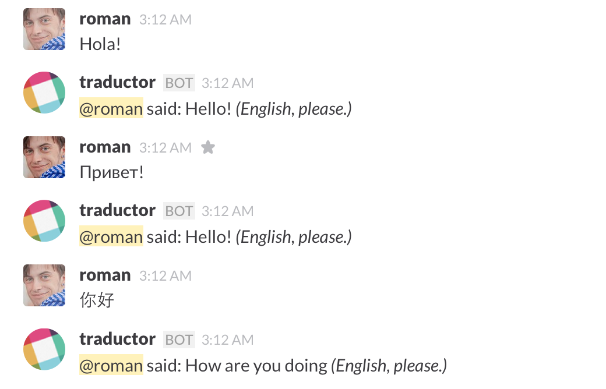

# slack-traductor
Slack bot to translate chat messages of any language into specified language



## Why?

Because we are an international team and sometimes I don't understand what they all are talking about.

## Usage

Traductor is using Microsoft Translator API, because it's free 😅

1. [Get Translator API account](https://datamarket.azure.com/dataset/bing/microsofttranslator)
2. [Create Slack bot](https://slack.com/apps/build/custom-integration)
3. Rename `.env.example` file into `.env` and fill in values in fields

  ```
  BOT_NAME=slack_bot_name
  BOT_TOKEN=slack_bot_token
  CLIENT_ID=microsoft_translator_client_id
  CLIENT_SECRET=microsoft_translator_client_secret
  TRANSLATE_TO=en
  ADD_MESSAGE=message_to_append
  SUSPEND_TIMEOUT=600000
  ```

  - BOT_NAME — bot name given when you create a bot
  - BOT_TOKEN — a token which you will receive after creating a bot
  - CLIENT_ID — take it from your Translator API account
  - CLIENT_SECRET — take it from your Translator API account
  - TRANSLATE_TO — translate messages to specified language, check lang codes in `lib/lang_codes.js`
  - ADD_MESSAGE — specify the message you want to add to every translation, check the screenshot above.
  - SUSPEND_TIMEOUT — the time period in ms while the bot will not translate messages

4. Install dependencies of a project
```
$ npm i
```

5. Start server
```
$ npm start
```

### Chat commands

`@traductor: stop` — suspend the bot for 10 minutes in current channel/group
